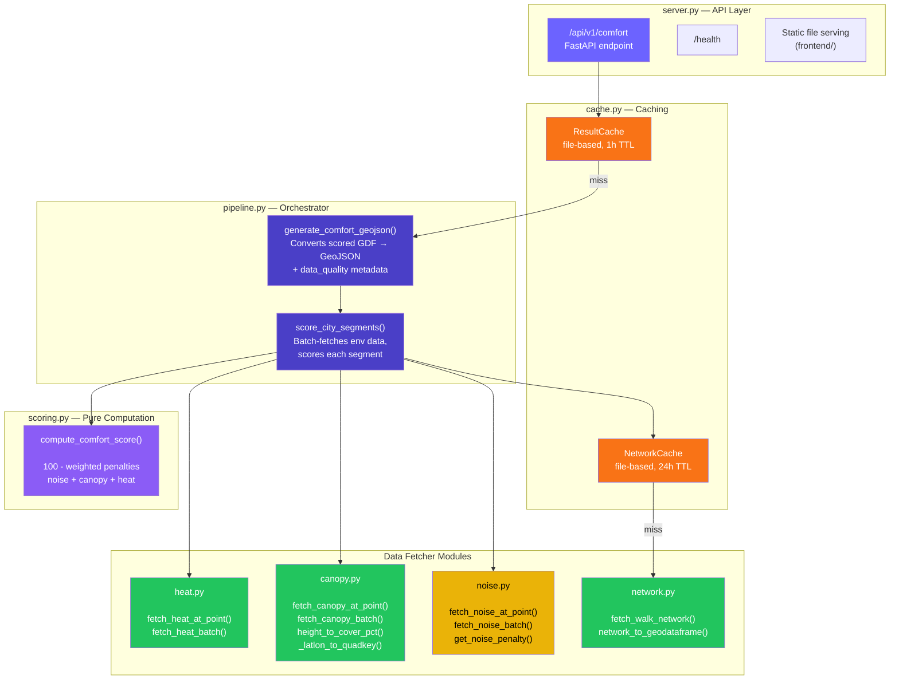
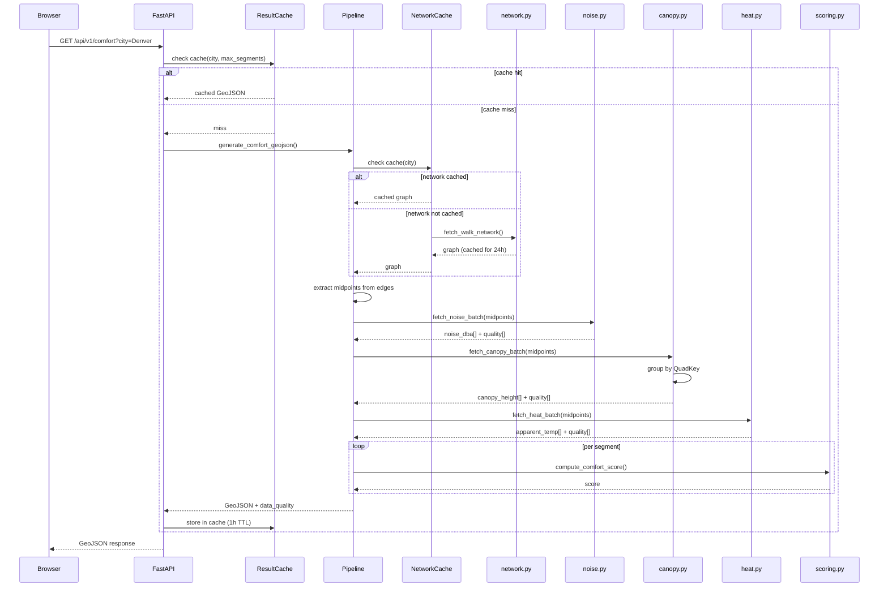

# Level 3 — Component Diagram

> What are the internal modules and how do they interact?

## Request Lifecycle

## Module Inventory

| Module | Lines | Responsibility | External Deps |
|--------|-------|---------------|---------------|
| `server.py` | ~70 | HTTP API, static files, CORS | FastAPI, uvicorn |
| `pipeline.py` | ~120 | Orchestration, GeoJSON assembly | osmnx, geopandas, shapely |
| `network.py` | ~50 | Walk network fetching | osmnx |
| `noise.py` | ~130 | DOT noise map queries | requests |
| `canopy.py` | ~220 | Meta/WRI canopy height reads | rasterio, boto3 |
| `heat.py` | ~100 | Open-Meteo apparent temperature reads | requests |
| `scoring.py` | ~100 | Comfort formula (pure math) | none |
| `cache.py` | ~80 | File-based caching with TTL | none (stdlib) |
