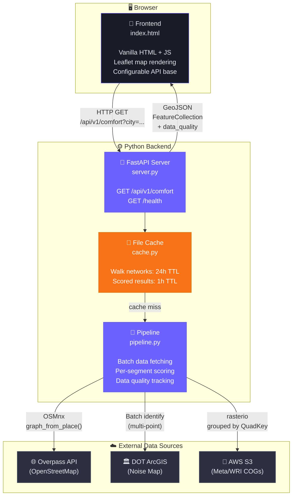

# Level 2 — Container Diagram

> What are the deployable units and how do they communicate?

## Containers

| Container | Technology | Purpose |
|-----------|-----------|---------|
| **Frontend** | HTML + JS + Leaflet | Renders scored map, handles user input |
| **FastAPI Server** | Python / uvicorn | REST API, serves frontend static files |
| **File Cache** | JSON/pickle on disk | Caches walk networks (24h) and scored results (1h) |
| **Pipeline** | Python (osmnx, rasterio, requests) | Orchestrates data fetching, scoring, GeoJSON assembly |
