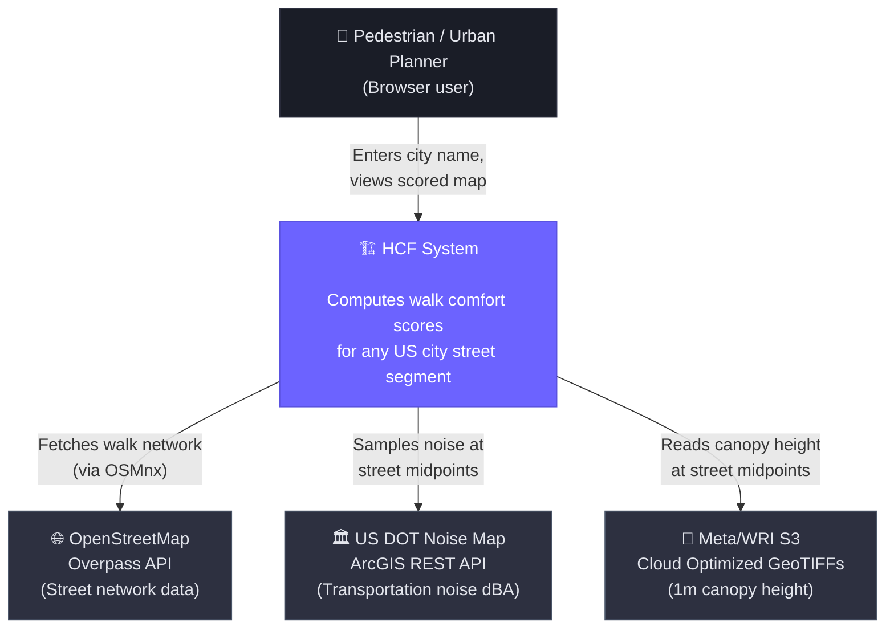

# Level 1 — System Context

> Who uses HCF and what external systems does it depend on?

## External Dependencies

| System | Protocol | Auth | Data | Rate Limits |
|--------|----------|------|------|-------------|
| OpenStreetMap Overpass | HTTP (via OSMnx) | None | Walk network graph (nodes + edges) | Soft — be polite, cache results |
| US DOT Noise Map | ArcGIS REST `identify` | None | Road noise dBA (raster pixel values) | None published, ~200ms/req |
| Meta/WRI Canopy Height | S3 (anonymous) via rasterio | None | Canopy height meters (COG pixel values) | S3 standard — effectively unlimited |

## Planned External Dependencies (Phase 2)

| System | Protocol | Auth | Data |
|--------|----------|------|------|
| NOAA Weather API | REST | API key (free) | Current temperature / heat index |
